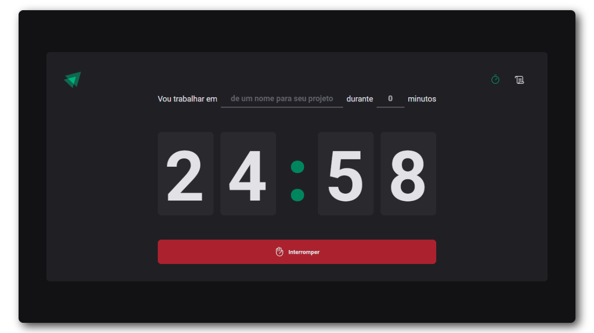

<h1 align="center">Timer App</h1>

<div align="center">
    
    
    
    
</div>

## :camera: Screenshot
<p align="center"></p>

## :page_with_curl: Description
A simple pomodoro application

## :gear: Running the App

### :globe_with_meridians: Web 
You can access this url: https://timer-app-mu.vercel.app/ if it is still working ¯\\_(ツ)_/¯

### :computer: Local
First fork and clone this repo. Feel free to create new pull requests

#### Install dependencies
```
yarn install
```

#### Run server
```
yarn dev
```

## :hammer_and_wrench: Tools
<p>


</p>


## :adult: Contributors

<!-- ALL-CONTRIBUTORS-LIST:START - Do not remove or modify this section -->
<!-- prettier-ignore-start -->
<!-- markdownlint-disable -->
<table>
  <tbody>
    <tr>
      <td align="center" valign="top" width="14.28%"><a href="https://www.gustavohenrique.site/"><br /><sub><b>Gustavo Henrique</b></sub></a><br /><a href="#code-Gustavohps10" title="Code">💻</a></td>
    </tr>
  </tbody>
</table>

<!-- markdownlint-restore -->
<!-- prettier-ignore-end -->

<!-- ALL-CONTRIBUTORS-LIST:END -->
